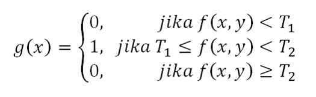
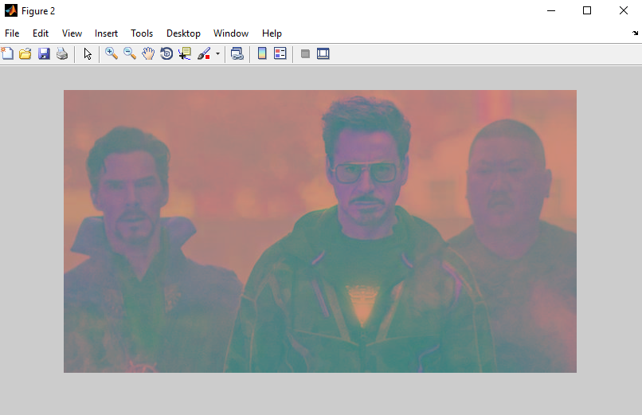
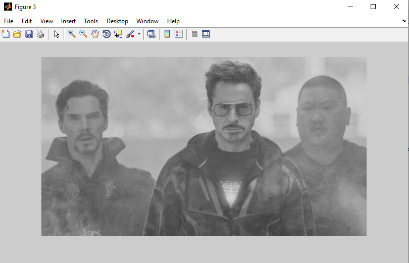
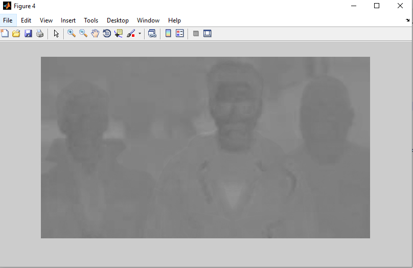
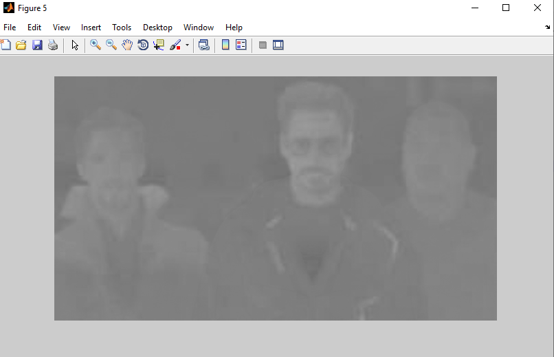
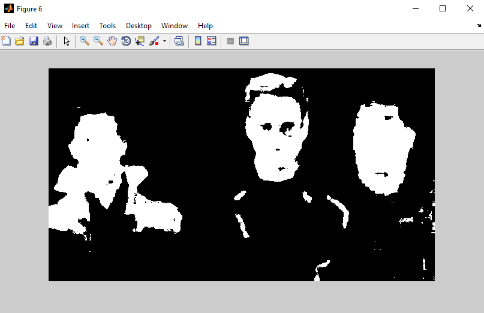
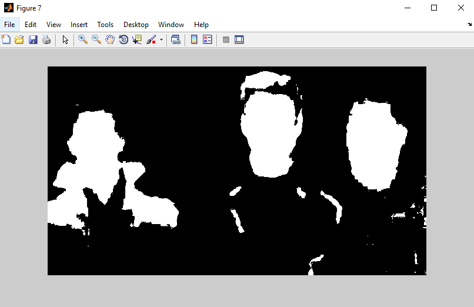
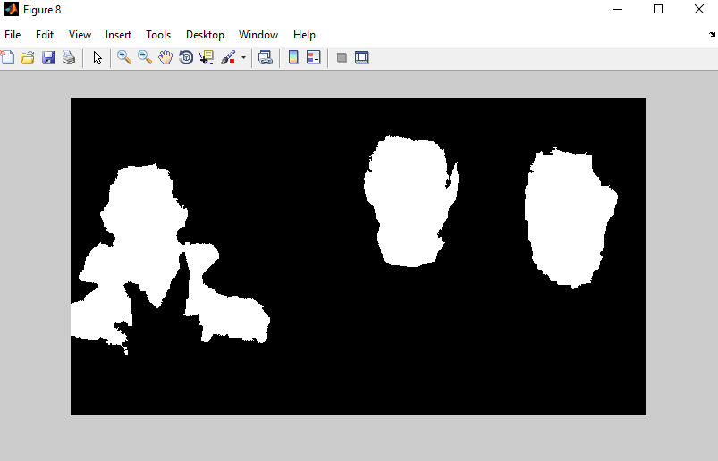
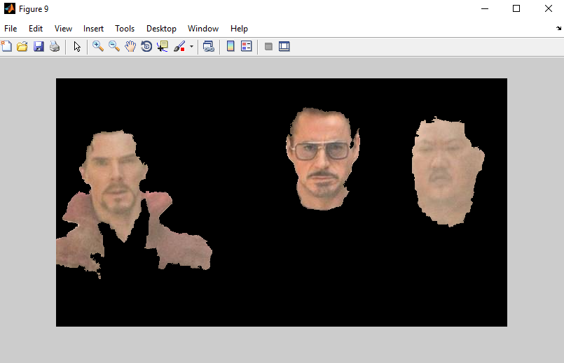
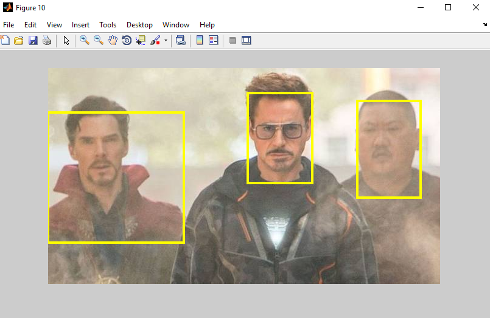

# Multilevel_Thresholding_Skin_Detection
Purpose: Skin or Human detection

Multi-level thresholding is an image segmentation method that uses two or more threshold values. 
The equation used to convert the pixel value of the grayscale image into binary in the multi-level thresholding method is:


Where: 
f(x,y) is a grayscale image 
g(x,y) is a binary image 
T1 is the lower threshold value 
T2 is the upper threshold value

An illustration of the change in pixel values ​​in the multi-level thresholding process is shown in the image below:


The following is an example of a digital image processing application along with MATLAB programming to segment skin color using the multi-level thresholding method. 
The steps are as follows:
## 1. Read original image
Open the file based on the directory

```
I=imread('closed today.jpg');
figure; imshow(I);
```
The result can be seen below:


## 2. RGB to YCbCr
Converts an image color space that was originally in the RGB color space to YCbCr

```
out=  uint8(zeros(size(I,1),size(I,2),size(I,3)));

%R,G,B component of the input image
R = I(:,:,1);
G = I(:,:,2);
B = I(:,:,3);

%inverse of the avg values of the RBG
mR = 1/(mean(mean(R)));
mG = 1/(mean(mean(G)));
mB = 1/(mean(mean(B)));

% smallest avg value
maxRGB = max(max(mR, mG), mB);

%calculate the scaling factors
mR = mR/maxRGB;
mG = mG/maxRGB;
mB = mB/maxRGB;

%scale the values
out(:,:,1)=R*mR;
out(:,:,2)=G*mG;
out(:,:,3)=B*mB;

%convert the RGB image to YCbCr
img_ycbcr=rgb2ycbcr(out);
figure, imshow(img_ycbcr);

```
Component: YCbCr


## 3. Extracting each component of Y, Cb, and Cr
From YCbCr, Extracting each component of Y, Cb, and Cr are able to do
```
Y= img_ycbcr(:,:,1);
Cb= img_ycbcr(:,:,2);
Cr= img_ycbcr(:,:,3);

figure, imshow(Y);
figure, imshow(Cb);
figure, imshow(Cr);
```
Component: Y


Component: Cb


Component: Cr



## 4. Perform multi-level thresholding on Cb and Cr 
In this part, the last result is not enough to be process directly, so it needs to perform multi-level thresholding on Cb and Cr components.
For the Cb component, thresholding is carried out with a value of T1 = 77 and T2 = 127. 
While for the Cr component, thresholding is carried out with a value of T1 = 133 and T2 = 193

```
[r,c,v] = find(Cb>=77 & Cb<=127 & Cr>=133 & Cr<=193);
numind=size(r,1);

bin=false(size(I,1),size(I,2));

%mark skin pixels
for i=1:numind
    bin(r(i),c(i))=1;
end

figure, imshow(bin);
```
Multilevel Thresholding Method



## 5. Perform morphological operations (Filling Empty Object)
Perform morphological operations in the form of filling holes to fill the empty object region

```
bin = imfill(bin,'holes');
figure, imshow(bin); 
```
Filled empty object as the result of morphological operations


## 6. Perform morphological operations (Eliminate noise)
Perform morphological operation in the form of opening area to eliminate noise (region that is not an object)
```
bin=bwareaopen(bin,9000);
figure, imshow(bin);
```
Eliminated noise


## 7. Visualize the result of segmentation on RBG image
Visualize the result of the skin segmentation on RBG image
```
R(~bin)=0;
G(~bin)=0;
B(~bin)=0;

out=cat(3,R,G,B);
figure, imshow(out);
```
The result of segmentation


## 8. Visualize the results with bounding box
Visualize the results of skin segmentation in the form of a bounding box
```
s=regionprops(bin, 'BoundingBox');
bbox=cat(1, s.BoundingBox);

RGB=insertShape(I,'rectangle',bbox,'LineWidth',4);
figure, imshow(RGB);
```
The result with bounding box



## Reference and 
See the video on my youtube channel:
https://youtu.be/y8xpbH-bGlM

MATLAB:
https://matlab.com


